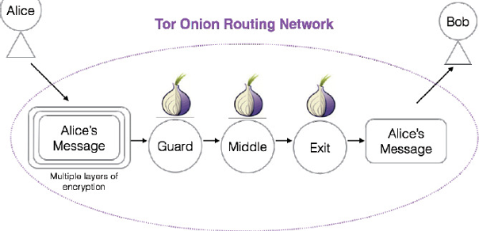

# TorBrowserPOC
Tor Browser POC Implementation in Java
<br />This Project developed in Computer Security Course , Open University.


#Short Description:



## Execute Server

The server must listening before the client is up.
<br />Use gradle for build executable jar:
```gradle
gradle serverJar
```

Run:
```java
java -jar TorBrowser-Server.jar
```


## Execute Client

Use gradle for build executable jar:
```gradle
gradle clientJar
```
Run:
```java
java -jar TorBrowser-Client.jar
```


## License
[MIT](https://choosealicense.com/licenses/mit/)
